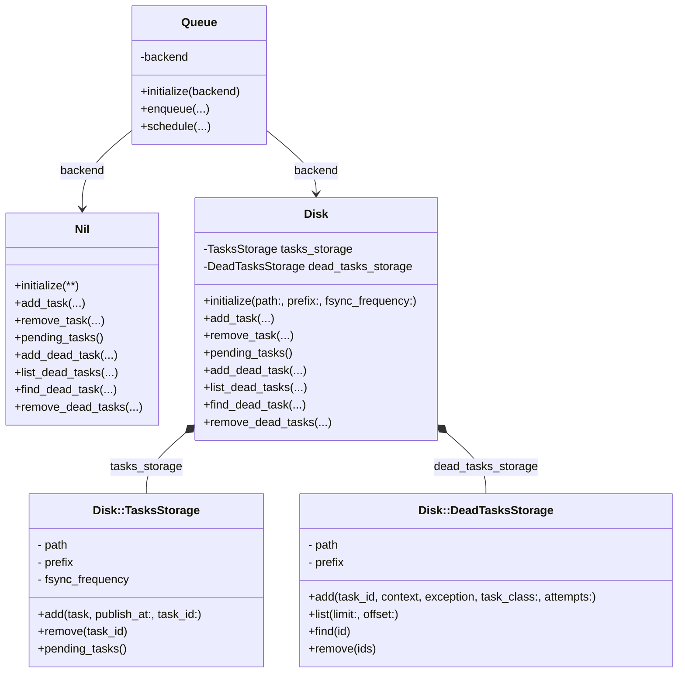
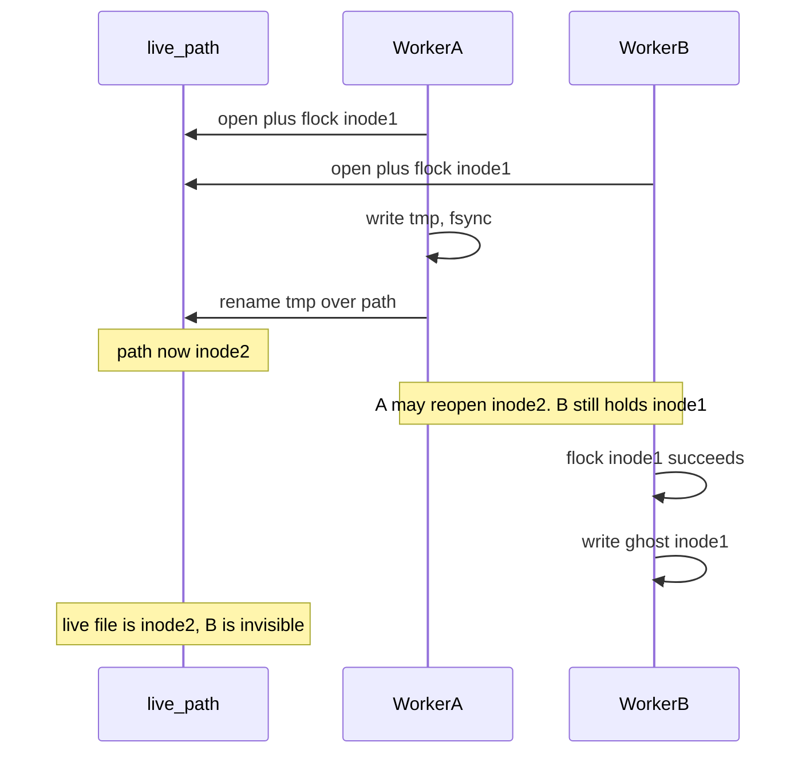
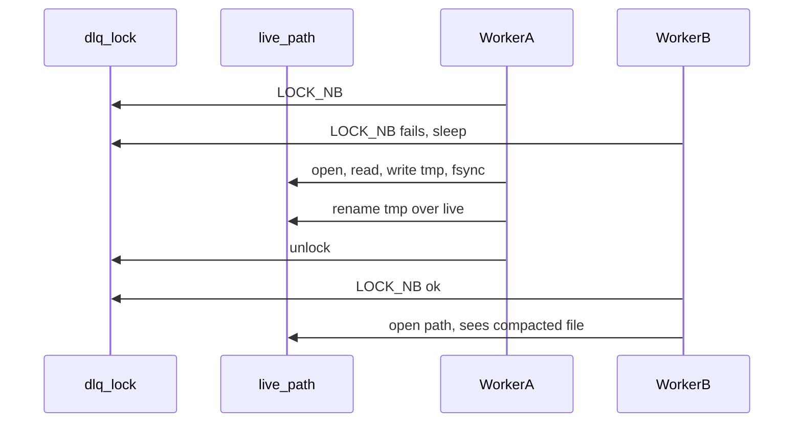
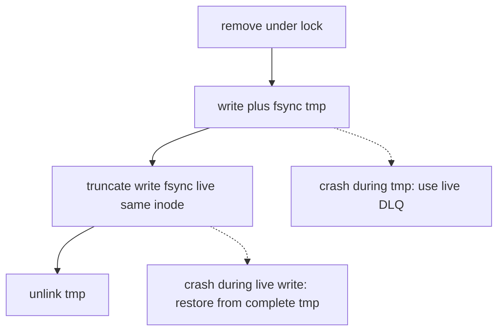

# Add durable dead-letter storage

## Goal

Add durable storage for deferred tasks that exhaust or abort their retries. A failed task must be recorded before it leaves the pending-task write-ahead log (WAL), so a crash cannot silently lose it.

## Context

`Rage::Deferred` already persists pending tasks in a disk-backed WAL. Previously, when a task had no retry remaining, the queue removed it from the WAL and discarded it. The disk backend therefore needs a separate durable store for dead tasks while remaining a single backend from the queue's perspective.

# Design

## Class dependencies




Runtime call shape:

```ruby
backend.add_task(...)
backend.remove_task(...)
backend.pending_tasks
backend.add_dead_task(...)
backend.list_dead_tasks(...)
backend.find_dead_task(...)
backend.remove_dead_tasks(...)
```


## File interfaces

`**[lib/rage/deferred/backends/disk.rb](lib/rage/deferred/backends/disk.rb)**`

```ruby
class Rage::Deferred::Backends::Disk
  def initialize(path:, prefix:, fsync_frequency:)
    @tasks_storage = TasksStorage.new(path:, prefix:, fsync_frequency:)
    @dead_tasks_storage = DeadTasksStorage.new(path:, prefix:)
  end

  def add_task(task, publish_at: nil, task_id: nil) end
  def remove_task(task_id) end
  def pending_tasks end
  def add_dead_task(task_id, context, exception, task_class:, attempts:) end
  def list_dead_tasks(limit: nil, offset: 0) end
  def find_dead_task(id) end
  def remove_dead_tasks(ids) end

  class TasksStorage
    def initialize(path:, prefix:, fsync_frequency:)
      # WAL setup
    end

    def add(task, publish_at: nil, task_id: nil) end
    def remove(task_id) end
    def pending_tasks end
  end

  class DeadTasksStorage
    STORAGE_VERSION = "0"

    def initialize(path:, prefix:)
      # live file: {path}/{prefix}dead_tasks-{STORAGE_VERSION}
    end

    def add(task_id, context, exception, task_class:, attempts:) end
    def list(limit: nil, offset: 0) end
    def find(id) end
    def remove(ids) end
  end
end
```

`**[lib/rage/deferred/backends/nil.rb](lib/rage/deferred/backends/nil.rb)**`

```ruby
class Rage::Deferred::Backends::Nil
  def initialize(**)
  end

  def add_task(_, **) end
  def remove_task(_) end
  def pending_tasks = []
  def add_dead_task(_, _, _, **) end
  def list_dead_tasks(**) = []
  def find_dead_task(_) end
  def remove_dead_tasks(_) = 0
end
```


## Configuration

Keep the existing public API. Do not add `tasks=` / `dead_tasks=` knobs — that would be a breaking change.

`**[lib/rage/configuration.rb](lib/rage/configuration.rb)**` (`Deferred`) stays as today:

- `**backend=**` — `:disk` (with optional `:path`, `:prefix`, `:fsync_frequency`) or `nil`
- `**backend**` getter — `@backend_class.new(**@backend_options)` (one facade instance)

```ruby
Rage.configure do
  config.deferred.backend = :disk
  # or:
  config.deferred.backend = :disk, path: "my_storage", prefix: "deferred-", fsync_frequency: 0.5
end
```

The Disk facade receives that same options hash. It passes `path` / `prefix` / `fsync_frequency` to `TasksStorage` (WAL). `DeadTasksStorage` reuses `path` and `prefix` only — no separate DLQ knobs, no `fsync_frequency`.

WAL init globs `#{prefix}#{STORAGE_VERSION}-*` (e.g. `deferred-0-*`). The DLQ file must not match that pattern. Use a **constant basename** (`dead_tasks`) plus its own `STORAGE_VERSION` in the filename (same idea as WAL: bump the constant when the on-disk format changes, leave old files alone):

```text
{path}/{prefix}dead_tasks-{STORAGE_VERSION}
# default: storage/deferred-dead_tasks-0
# custom prefix "jobs-": storage/jobs-dead_tasks-0
```

`deferred-dead_tasks-0` does not match `deferred-0-*`, so WAL will not claim the DLQ file on boot. Do **not** put the WAL version immediately after the configured prefix (e.g. `deferred-0-dead_tasks`) — that *would* match the WAL glob. `prefix` still comes from `backend=` so a custom prefix applies to both stores.

For `backend = nil`, the facade methods remain no-ops. `Nil` has no nested storage classes.

## Writing to the dead-tasks store

Give-up in `[Queue#schedule](lib/rage/deferred/queue.rb)` writes the dead task **before** removing it from the tasks WAL. If `add_dead_task` raises, the WAL entry stays (at-least-once). Success path: durable DLQ write, then `remove_task`.

One shared data file (`{path}/{prefix}dead_tasks-{STORAGE_VERSION}`) so listing all dead tasks is a single scan.

### Race conditions and other issues

The design must account for three failure categories across writes and locking. Each one is paired with its resolution below.

#### Mid-write crash

##### During record add

A crash during `add` can leave the final record only partially written and without its terminating newline. CRC validation makes that fragment unreadable, but it does not make the next append safe. Appending a new record directly joins it to the fragment, producing one corrupted line. The new record can then be lost even though its write and `fsync` succeed and Queue removes its WAL entry.

**Resolution.** Repair the tail under the lock file before every append. Open the data file for read/write append, check its final byte, and do nothing when the file is empty or already ends with `\n`. Otherwise, scan backward in bounded-memory chunks for the previous newline and truncate immediately after it; truncate to zero when the file contains no complete line. Then append the new record and `fsync`. The same `fsync` persists both the truncation and the new entry, while every earlier complete record remains untouched.

##### During rewrite on removal

Truncating and rewriting the live file in place can leave it empty or half-written if the process dies. The dead tasks are then gone for good: they already left the WAL.

**Resolution.** Write the survivors to a temp file, `fsync` it, then `rename` the temp over the live data path. A crash during the temp write leaves the live file unchanged, and an orphan `.tmp` is harmless.

#### Multi-worker race

`flock` is tied to an **inode**, not to a path. A worker that keeps a long-lived fd on the data file and then `rename`s a new file onto that path leaves the other workers holding the **old**, now unlinked, inode. Their writes go to a ghost file, and a later `remove` can `rename` that ghost back over the live path:




There are two ways out.

**Resolution: lock file (selected).** Flock a file that is **never** renamed (`{prefix}dead_tasks.lock`). Open the data file **by path** only while holding that lock. After `rename`, waiters still serialize on the same lock inode; the next data `open(path)` sees the new image. Never cache a data fd — keep only `@lock` from init, and let every `add` / `list` / `find` / `remove` open the data path under that lock.




```text
storage/{prefix}dead_tasks-{ver}       data, may be renamed
storage/{prefix}dead_tasks.lock        lock only, never renamed
storage/{prefix}dead_tasks-{ver}.tmp   compaction staging
```

- Pros: lock inode never changes, so `rename` of data cannot split workers; `remove` needs no data-fd reopen dance; hard to regress by caching a data fd.
- Cons: extra file on disk; two paths to keep straight (lock vs data); lock file must never be renamed or unlinked as part of compact.

**Alternative: temp as journal, in-place live write (no live** `rename`**).** Keep the live inode so long-lived `flock` on the data file still works. Write the new image to `.tmp`, `fsync`, then **overwrite** the live file (truncate + write + `fsync`), then unlink `.tmp`. Crash during temp write: live DLQ intact. Crash during live overwrite: live file may be torn until **recovery copies a complete temp back onto live**.




- Pros: live inode stays stable, so a long-lived data `flock` still serializes workers; no lock file; crash during tmp write leaves live DLQ intact.
- Cons: crash during live overwrite tears the DLQ until recovery from a complete temp; must detect a complete journal and run recovery at boot; writes the image twice.

Does not mean “always trust DLQ after any crash” unless recovery ran.

#### Same-worker fibers

Rage runs one OS thread per worker with many fibers on it, so a blocking `LOCK_EX` is out: it parks the thread and stalls every fiber in the process. Contenders take `LOCK_EX | LOCK_NB` and `sleep` to retry instead. That serializes other processes, but not the other fibers in this one: `flock` on a shared fd does not exclude them, and a second `LOCK_EX` on that fd succeeds as a re-acquire. Two give-up fibers can then overlap, and one `ensure` can unlock while the other is still mid-compaction.

**Resolution.** A process-local flag in the same retry loop as `flock` (`until !@locked && @lock.flock(...)`): set it on acquire, clear it in `ensure`.

Non-blocking lock and temp-file rewrite are complementary: `LOCK_NB` + `sleep` avoids freezing the worker while **waiting** for the lock; temp → `fsync` → `rename` avoids wiping the store if a crash happens mid-**rewrite**.

### Add algorithm

Append one record under the **lock file**. Serialize the record before acquiring the lock so serialization does not extend the lock hold time. If lock acquisition retries, the fiber-aware `sleep` yields execution while preserving the local `entry` value. Open the data file **by path** only while the lock is held; do not keep a long-lived data fd.

Initialization creates the live data file when needed and `fsync`s its parent directory so the file's directory entry is durable before any dead task can be added and removed from the WAL.

1. Serialize the record into a CRC-prefixed log line
2. Acquire `LOCK_EX | LOCK_NB` on `{prefix}dead_tasks.lock` and set the process-local locked flag; raise `DeadTasksLockTimeout` if the retry cap is hit
3. Open the live data path for read/write append
4. If the file does not end with `\n`, scan backward to the previous newline and truncate the incomplete suffix; truncate to zero if there is no complete line
5. Write the line and `fsync`
6. Unlock the lock file and clear the locked flag in `ensure`

`flock` with `LOCK_NB` returns false immediately when another worker holds the lock. The lock helper then yields the fiber with sleep before retrying. If the lock is not acquired within the fixed retry limit, it raises DeadTasksLockTimeout, leaving the task in the WAL for recovery.

A crash mid-write can still leave a **partial last line**. Reads drop it as corrupted, and the next `add` removes that incomplete suffix under the lock before appending. Every earlier complete line remains intact. There is no temp file on this path: repairing only the invalid tail and then `fsync`ing the repair with the new entry is sufficient.

### Remove algorithm

For a non-empty list of IDs, scan and compact the store under the **lock file**. Open the live data file by path while holding the lock and write valid records that should remain into a temporary file. Replace the live file only when at least one requested ID was found. Do not keep a long-lived data fd.

1. return `0` immediately when it is empty
2. Acquire `LOCK_EX | LOCK_NB` on `{prefix}dead_tasks.lock` and set the process-local locked flag; raise `DeadTasksLockTimeout` if the retry cap is hit
3. Create or truncate `{prefix}dead_tasks-{STORAGE_VERSION}.tmp`, then open the live data path
4. Read the live file one line at a time:
   - omit malformed or CRC-invalid records from the temporary file
   - record each requested task ID that was found
   - copy every other valid record to the temporary file
5. If no requested ID was found, close and unlink the temporary file without `fsync`, leave the live file unchanged, and return `0`
6. If at least one requested ID was found, `fsync` the temporary file
7. `rename` the temporary file over the live data path
8. `fsync` the parent directory so the replacement directory entry is durable
9. Return the number of distinct requested IDs that were found and removed
10. Unlock the lock file and clear the locked flag in `ensure`

```text
Worker A (remove A): flock(.lock) → open path → tmp without A → fsync tmp → rename → fsync dir → unlock .lock
Worker B (remove B): (waiting on .lock)
Worker B:            flock(.lock) → open path (A already gone) → tmp without B → fsync tmp → rename → fsync dir → unlock
```

If the process dies mid-temp write, the live data file is unchanged; an orphan temp is harmless. Malformed or CRC-invalid records are removed only when at least one requested ID was found and the temporary file replaces the live file. The parent-directory `fsync` makes the replacement durable before a later add can rely on the new live inode.

**Lock contention during compaction.** `remove` holds the shared lock while it scans the live file, writes and `fsync`s the temporary file, renames it, and `fsync`s the parent directory. The lock duration therefore grows with the size of the dead-tasks store. Other operations use bounded non-blocking retries and raise `DeadTasksLockTimeout` if they cannot acquire the lock. If `add` times out, Queue leaves the task in the WAL so it can be recovered on the next start. This favors at-least-once recovery over waiting indefinitely for the lock.

### Durability and crash consistency summary

1. **Only one operation uses the store at a time.** The permanent lock file ensures that only one process or worker accesses the dead-tasks store at a time. The local `@locked` flag provides the same protection between fibers inside one worker. After taking the lock, every operation opens the live data file by its current path, so it sees the result of the latest completed removal.

   **What this guarantees:** two operations cannot run at the same time and overwrite each other's changes. If the lock cannot be acquired before the timeout, the operation does not change the dead-tasks store. A timed-out add leaves the task in the WAL.

2. **The dead-tasks storage file is safely created.** Initialization creates the live data file when it does not exist and then `fsync`s the storage directory. Creating a file changes its directory, and a later `fsync` of the file itself does not guarantee that its filename will survive a host crash. Without the directory `fsync`, the first dead-task record could be durably written to the file while the file is no longer reachable by its expected name after recovery.

   **What this guarantees:** after initialization returns, a host crash cannot lose the live filename from an existing storage directory. If initialization is interrupted, the file may or may not exist, but no dead-task write has succeeded yet and the next initialization can safely create or open it again.

3. **An unfinished final write is discarded before the next add.** Before appending a record, `add` checks whether the file ends with a complete line. If it does not, `add` truncates the unfinished trailing fragment back to the last complete line. It does not recover the interrupted record. It then writes the new checksummed record and `fsync`s the live file before returning.

   **What this guarantees:** after `add` returns, the new record and all earlier complete records are durable. If a crash interrupts the add, the file may end with an incomplete record. Reads ignore that fragment, the next add discards it before writing, and Queue keeps the interrupted task in the WAL because its DLQ add did not succeed. A complete newline-terminated record that fails its CRC is not removed by `add`; reads skip it and a later compaction currently drops it.

4. **A removal never rewrites the live file in place.** `remove` writes all records that should remain to a temporary file and `fsync`s it. It then renames the temporary file over the live file and `fsync`s the storage directory before returning.

   **What this guarantees:** after `remove` returns, both the remaining records and the replacement of the live file are durable. The removed records cannot reappear after a crash when the filesystem provides the expected `fsync` and rename guarantees.

   A crash before the rename leaves the old live file unchanged and may leave an unused temporary file. A crash after the rename but before the directory `fsync` finishes may recover either the old or the new version of the live file. In that case the removal never returned successfully, so its result was not acknowledged.

5. **A task is written to the dead-tasks store before it leaves the WAL.** Queue calls `add_dead_task` and waits for it to succeed before recording the corresponding removal in the tasks WAL.

   **What this guarantees:** a task cannot be successfully removed from the WAL before it has been durably written to the dead-tasks store. A crash between these two operations can leave the task in both stores and cause it to be replayed. The handoff therefore provides at-least-once rather than exactly-once behavior. It can create a duplicate record, but it does not silently lose the task.

These guarantees assume a local filesystem that supports file locks, atomic renames within one directory, and reliable `fsync` for files and directories. They cover worker termination, process crashes, and host or OS crashes. They do not cover damaged storage, storage that reports a successful `fsync` without saving the data, or network filesystems with weaker guarantees.

If a filesystem operation raises an error, the operation is not considered successful even though part of it may already be visible. In particular, the rename happens before the directory `fsync`. If that `fsync` fails, callers cannot know whether the removal will survive a later host crash. Retrying the removal and finding no matching record does not prove that the earlier rename is durable.

# Implementation constraints

- Preserve the existing `config.deferred.backend` public API.
- Keep one backend facade instance rather than separately configurable pending and dead-task backends.
- Never remove a pending task before its dead-task record is durable.
- Never block the worker thread while waiting for a file lock.
- Never rewrite the live dead-task file in place during removal.
- Assume a local filesystem with file locking, atomic rename within a directory, and reliable file and directory `fsync`.

# Acceptance criteria

- [x] The Disk backend acts as a facade over separate pending-task and dead-task storage classes while preserving the existing deferred backend configuration.
- [x] Disk and Nil implement the complete backend interface used by the queue: add, remove, and recover pending tasks, plus add, list, find, and remove dead tasks.
- [x] When a task exhausts or aborts its retries, the queue writes its dead-task record before removing its pending WAL entry.
- [x] Dead-task records preserve the task identity, execution context, attempt count, timestamps, and final exception details in a versioned, checksummed disk format.
- [x] The shared dead-task store serializes access across workers and fibers without blocking the worker thread while waiting for its lock.
- [x] Adding and removing records follow the crash-consistency guarantees defined in the Approach section.

# Verification

- Verify backend lifecycle and configuration: Disk and Nil preserve the existing configuration contract, use their expected persistence behavior, and safely survive restarts or backend switching.
- Verify task transitions: exhausted or explicitly aborted tasks enter dead-task storage before leaving the WAL, while successful tasks never enter it.
- Verify record fidelity and access: all required task and failure data round-trips correctly, including arbitrary serialized content, and records can be listed, paginated, and found by ID.
- Verify removal semantics: single, multiple, duplicate, missing, empty, and complete removals affect only the intended logical tasks and report accurate counts.
- Verify concurrent and failed operations: workers and fibers serialize access without data loss, and lock timeouts leave pending tasks recoverable from the WAL.
- Verify crash and corruption handling: torn appends, interrupted removals, stale temporary files, and invalid checksums do not compromise earlier valid records or later successful operations.

# Result

- Implemented and merged in [rage-rb/rage#383](https://github.com/rage-rb/rage/pull/383).
- Merge commit: [`15f3b31a64a5b4e34cea82eeb95868b2d89f87b7`](https://github.com/rage-rb/rage/commit/15f3b31a64a5b4e34cea82eeb95868b2d89f87b7)
